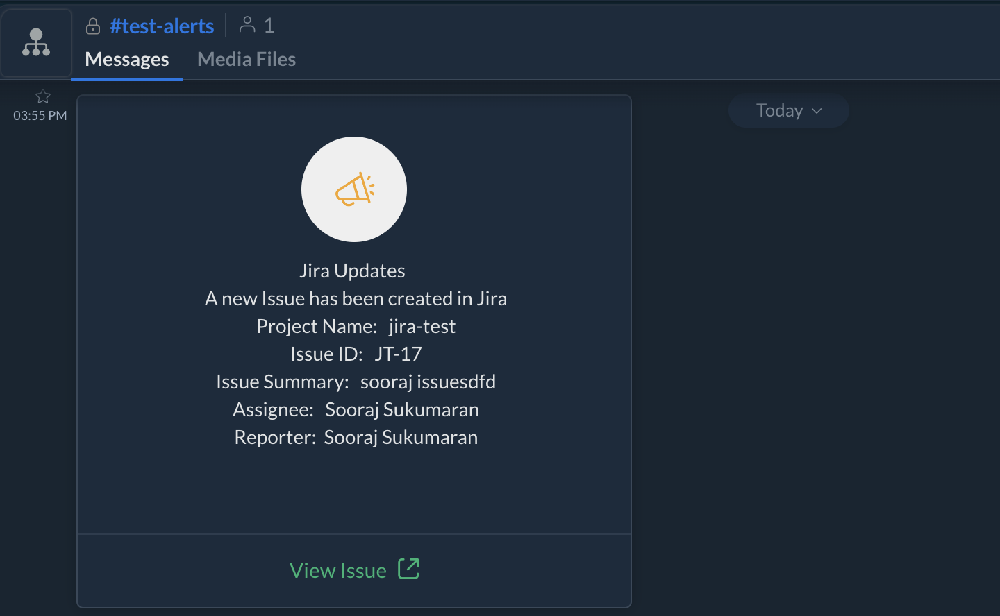
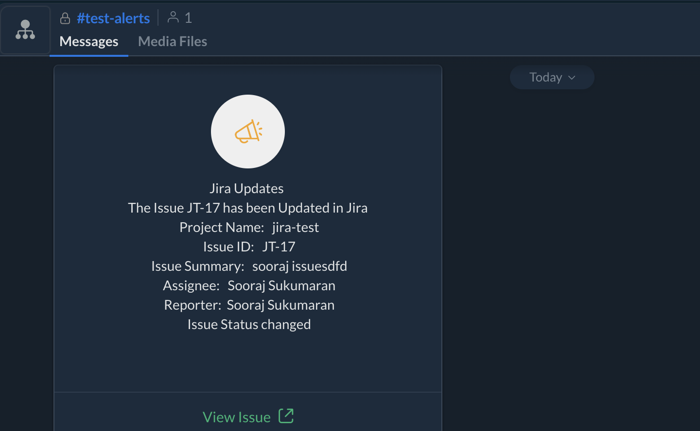
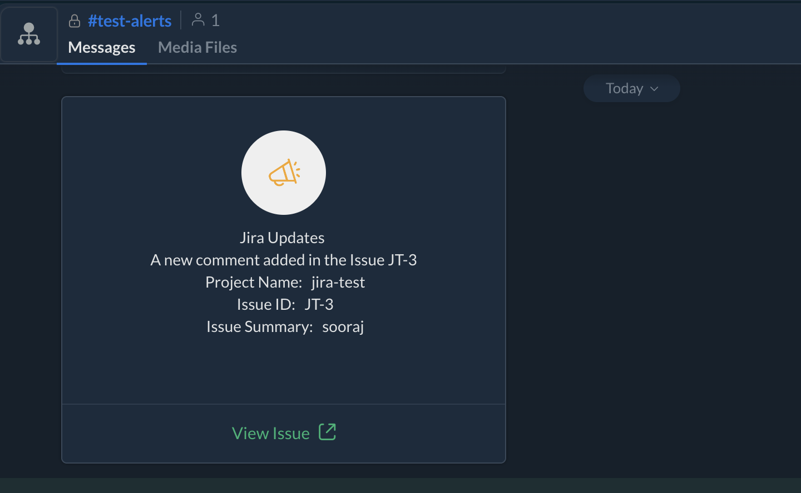
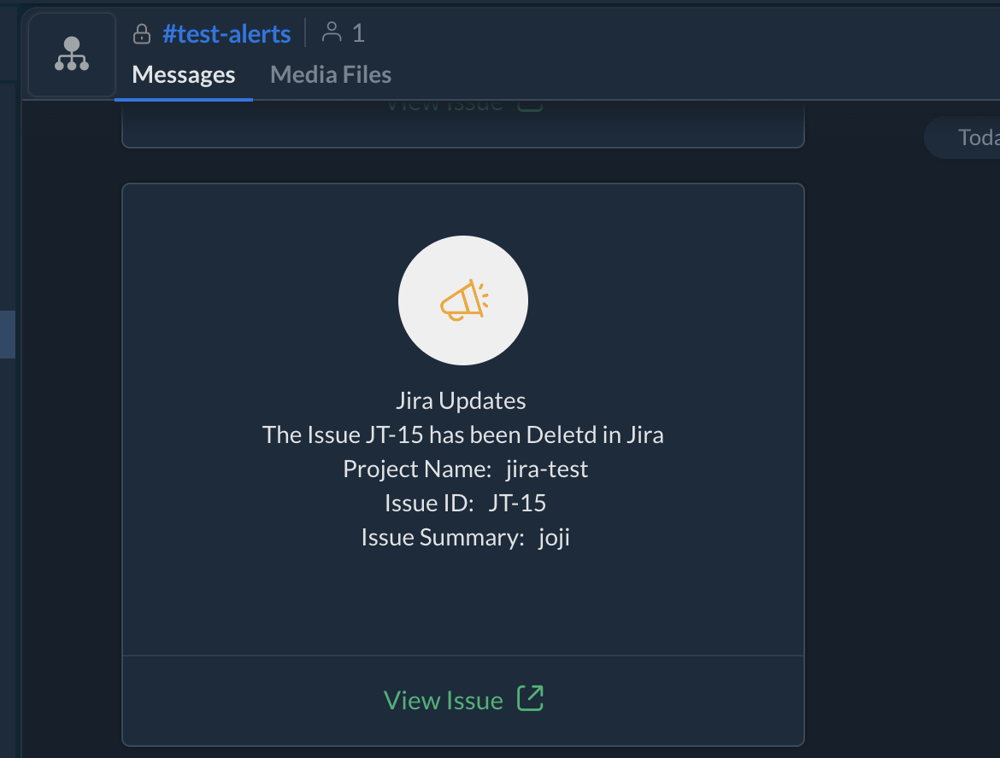
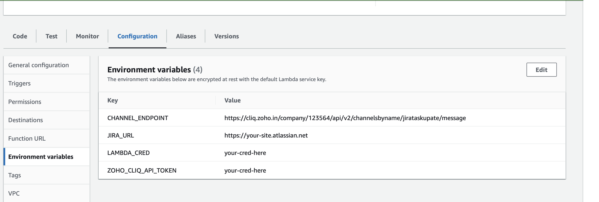
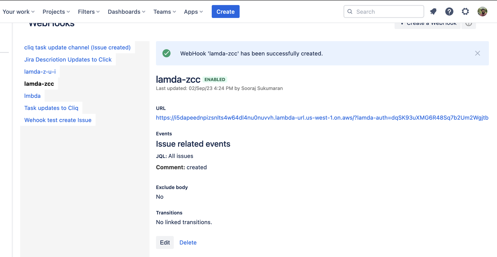

# Jira Webhook Event Processor with Zoho Cliq Integration

This application is designed to process Jira webhook events and send messages to Zoho Cliq channels. It is implemented as an AWS Lambda function. The Lambda function validates the incoming webhook event and sends a formatted message to a Zoho Cliq channel. We can send the following updated to the channel.
1. Issue created

2. Issue Updated

3. Comment added

4. Issue Deleted

## Prerequisites

Before deploying and using this application, you need to have the following:

1. **AWS Account**: You need an AWS account to deploy and run the Lambda function.

2. **AWS Lambda**: Familiarity with AWS Lambda and how to deploy Lambda functions.

3. **Zoho Cliq Account**: You must have a Zoho Cliq account to obtain an API token.

4. **Jira Webhook Configuration**: Configure a webhook in your Jira instance to send events directly to the AWS Lambda function URL.

5. **Environment Variables**: You should set up the following environment variables in your AWS Lambda function:
   - `ZOHO_CLIQ_API_TOKEN`: Your Zoho Cliq API token.
   - `JIRA_URL`: The base URL of your Jira instance.
   - `LAMBDA_CRED`: User Generated sceret to protect the endpoint.
   - `CHANNEL_ENDPOINT`: API endpoint of your channel.

## Application Flow

1. Jira sends a webhook event directly to the Lambda function URL.

2. The Lambda function is triggered by the incoming event.

3. It validates the event data, ensuring it's not empty.

4. custom authentication parameter (`lamda-auth`) is set in the query parameters, it checks for the parameter's existence and value.

5. The Lambda function then extracts relevant information from the Jira webhook payload, such as issue key, summary, and project name.

6. It constructs a message for Zoho Cliq, including issue details and a link to the Jira issue.

7. The message is sent to a Zoho Cliq channel using the Zoho Cliq API.

8. The Lambda function responds to the webhook with a success message and status code.

## Deploying the Application
1. **Build and archive the code**: Go to the directory and build the code.   
Eg :  
``$ cd comments/created``  
``$ GOOS=linux GOARCH=amd64 go build -o commented comment.go``

1. **Deploy Lambda Function**: Deploy the Lambda function with the necessary environment variables (ZOHO_CLIQ_API_TOKEN, JIRA_URL, LAMBDA_CRED) and enable the Function URL. See the screenshot below. 

2. **Configure Jira Webhook**: In your Jira instance, configure a webhook that sends events directly to the Lambda function URL. Set the authentication parameter (`lamda-auth`) in the webhook URL.

3. **Testing**: Test the setup by triggering Jira events and verifying the Zoho Cliq messages.

## Example Usage

Here is an example of how this application processes a Jira webhook event:

- Jira sends a webhook event directly to the Lambda function URL.

- The Lambda function validates the event data and checks for the presence of the `lamda-auth` query parameter if set.

- It extracts relevant information from the event payload, such as issue key, summary, and project name.

- The Lambda function constructs a message for Zoho Cliq, including issue details and a link to the Jira issue.

- The message is sent to a Zoho Cliq channel using the Zoho Cliq API.

- The Lambda function responds to the webhook with a success message and status code.

## Customization

- Add error handling and logging as needed.

- Customize the response messages and status codes based on your application requirements.

By following this documentation, you can set up and customize the Jira webhook event processor with Zoho Cliq integration for your specific use case, even when directly invoking the Lambda function using its URL.
